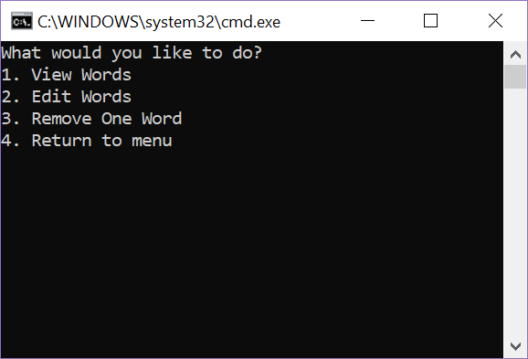
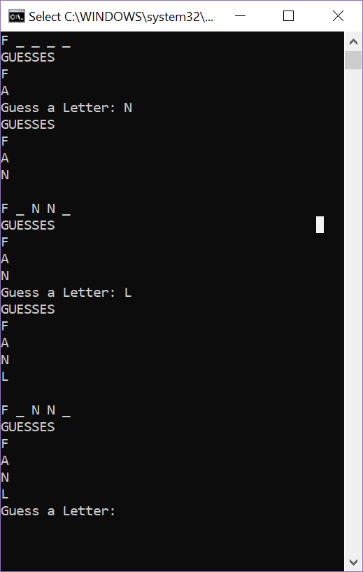
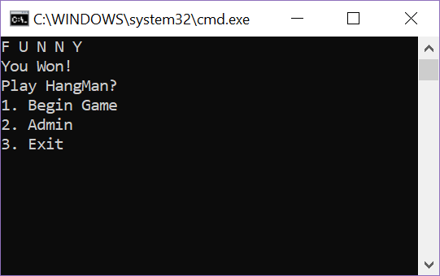

# Lab03-WordGuessingGame

## Description
From a pre-written file, generate a random, hidden word. (ex _ _ _) to guess. After each guess, if your guess is correct, that letter will be revealed (ex C _ ).
Once you guess the word, you win!

If the list of words isn't long enough, or you just don't like one of the words, go into the admin menu! Add and delete words to your hearts content!

## Instructions

### Game Instructions
- Select 1 on the menu to start the game.
- Enter a single letter that is your guess. If you enter more than one letter, the game will ask you to try again.
- See if you got it right!
- Continue until you guess the word!
- Play again if you so choose.

### Admin Instructions
- Enter in the number corresponding to the task you would like to complete.
- Follow the prompts. 
- When adding or deleting a word, be sure to spell the words correctly, and not to add any spaces or weird symbols, or you will have to enter the word again.

## Visuals

### Menu

### Admin Menu

### Game Play Demo

### Winning Screen

